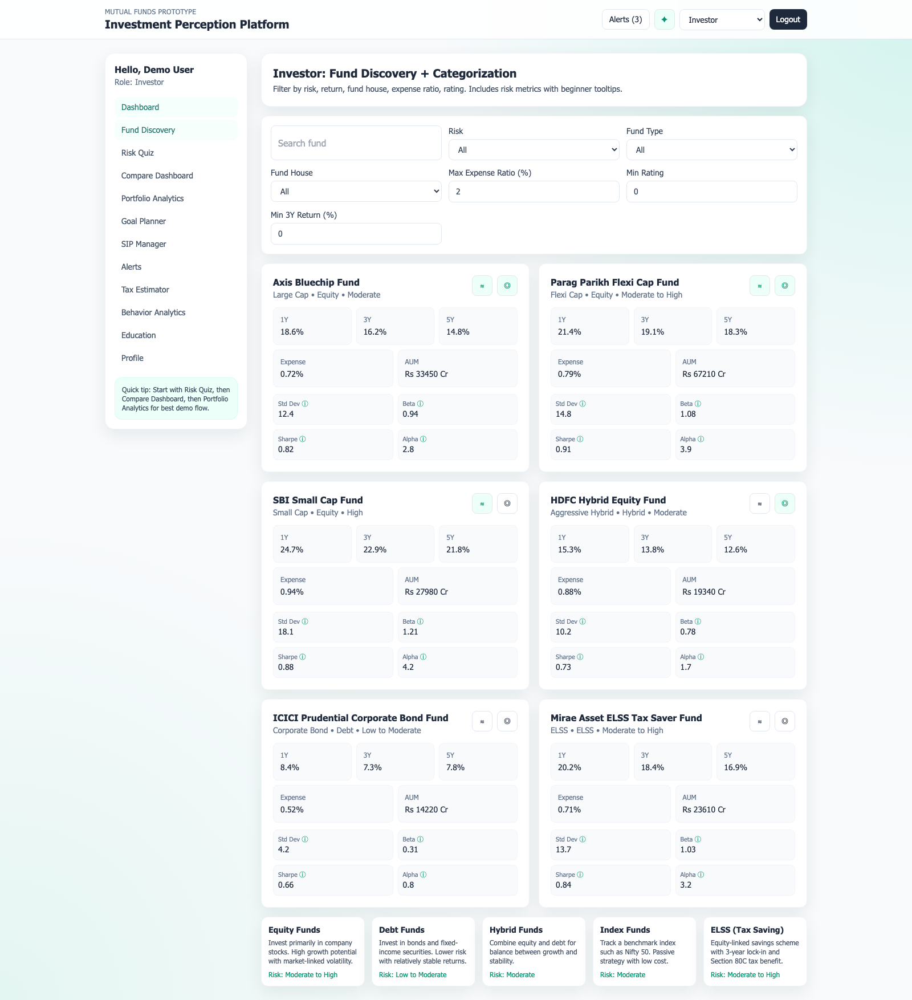
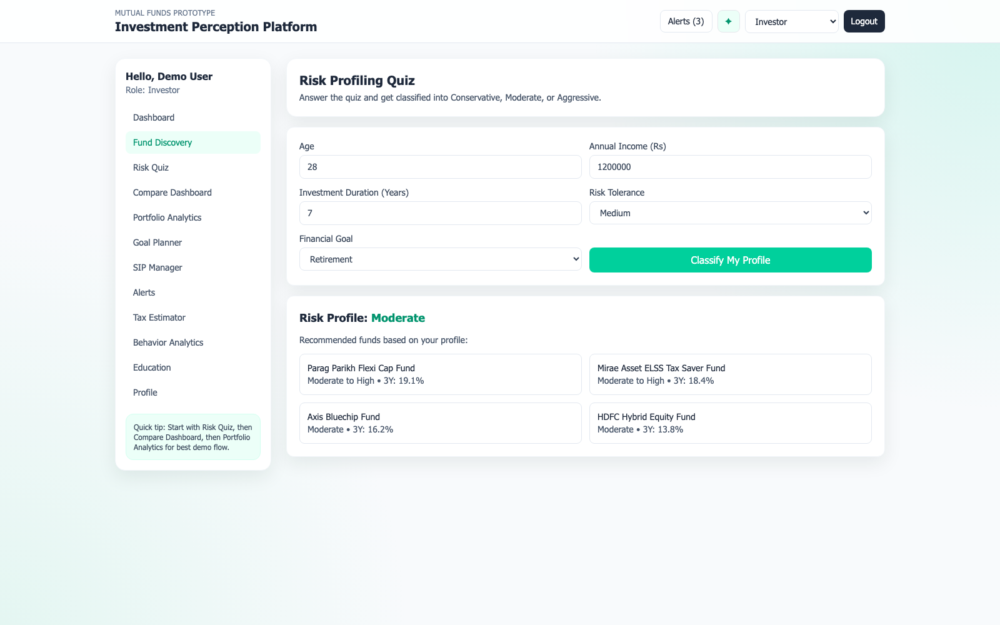
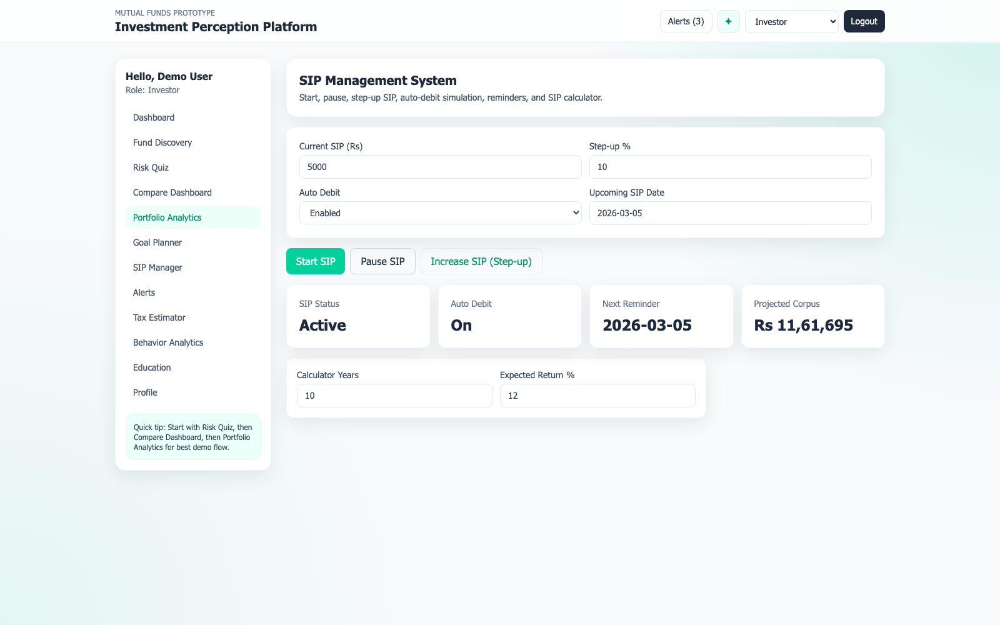
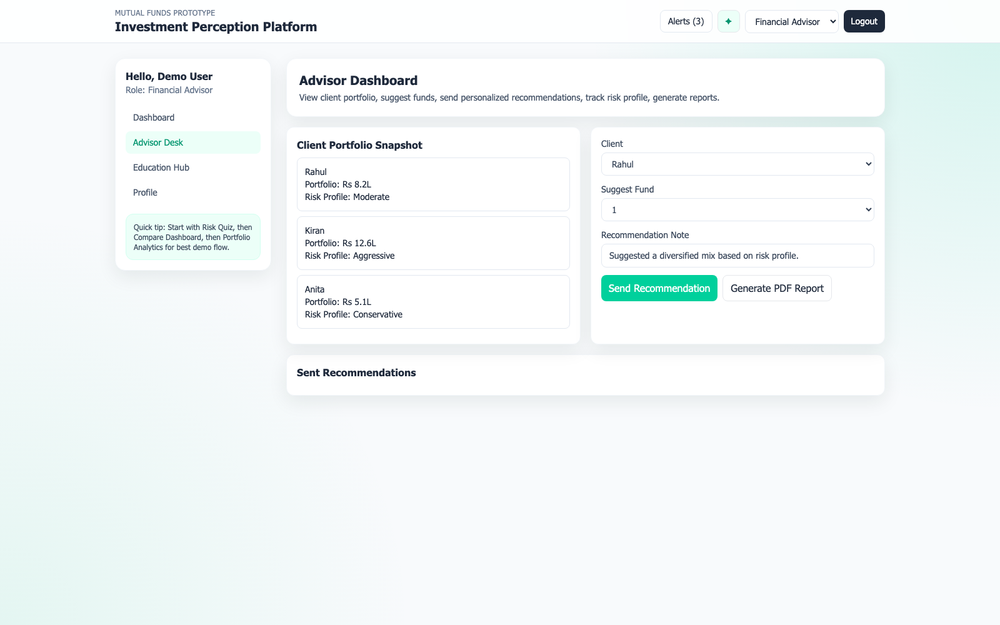
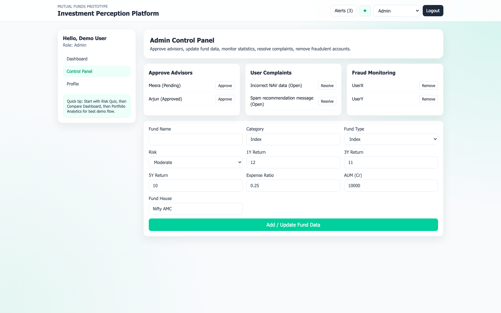

# Mutual Funds Insight Platform (Frontend Prototype)

A role-based **Mutual Fund Investment Perception** web prototype built for full-stack project submission (current scope: frontend + UI/UX only).

This platform helps users understand mutual funds, compare them, assess risk, and simulate investment decisions with interactive dashboards inspired by Groww/Zerodha-style UX.

## Project Scope (Current)
- Frontend-only prototype
- No backend/API/database integration yet
- All operations are UI-simulated using mock data
- Role-based flows for:
  - Investor
  - Admin
  - Financial Advisor
  - Data Analyst

## Tech Stack
- **Node.js**
- **React.js**
- **Vite**
- **React Router DOM**
- **Tailwind CSS**
- PostCSS + Autoprefixer

## Roles and Features

### 1) Investor
- Fund Discovery (search + filtering + categorization)
- Risk Profiling Quiz
- Fund Comparison Dashboard
- Portfolio Analytics
- Goal-Based Investing
- SIP Management
- Alerts & Notifications
- Tax Estimation
- Behavioral Analytics
- Education Feed

Investor capabilities include:
- Compare funds side-by-side on 1Y/3Y/5Y returns, expense ratio, risk, AUM, fund manager, and exit load
- Profile-based classification (Conservative/Moderate/Aggressive)
- Portfolio metrics: total invested, current value, P/L %, XIRR, asset & sector allocation
- Goal planning: required SIP, expected corpus, time-to-goal
- SIP controls: start/pause/step-up, reminders, auto-debit simulation

### 2) Admin
- Approve advisors
- Add/update fund data (UI simulation)
- View platform-level statistics
- Handle user complaints
- Remove fraudulent accounts

### 3) Financial Advisor
- View client snapshot
- Suggest funds
- Send personalized recommendations
- Track client risk profile
- Generate investment report (UI simulation)
- Post educational content (article/video/market analysis/risk guide)

### 4) Data Analyst
- Monte Carlo simulation (visual prototype)
- Market sentiment indicator
- NAV integration simulation
- Portfolio rebalancing engine toggle
- Advanced analytics-style cards

## Special Features Implemented
- Rule-based **AI-powered insights**
- Risk & volatility metrics with beginner tooltips (Std Dev, Beta, Sharpe, Alpha)
- Mutual fund type explainers: Equity, Debt, Hybrid, Index, ELSS
- Interactive charts: bar, line, pie allocation charts

## Screenshots

### Login


### Investor - Fund Discovery


### Investor - Risk Profiling Quiz


### Investor - Portfolio Analytics


### Investor - SIP Management


### Financial Advisor Dashboard


### Admin Control Panel


## Run Locally
```bash
npm install
npm run dev
```

## Current Limitations
- No real authentication backend
- No real transaction execution
- No real-time NAV APIs
- No database persistence (state resets on refresh)
- PDF/report generation is UI-simulated
